 
# Mova-Movies App

"A movie and TV show information app for teaching MVVM, Paging3, Flow-Coroutines with Clean Architecture

 With this app, you can easily find information about your favorite films and TV series.
You can view the cast, plot summary, release date, and more. "

<div style="text-align: center">

 [](https://android-arsenal.com/api?level=24)

 [](https://opensource.org/licenses/Apache-2.0) 

</div>

 ## Demo
 
 <div>
 
 
 
 
 
 </div>
 
 
 
## Screeshots

### Light Version
***
<div>
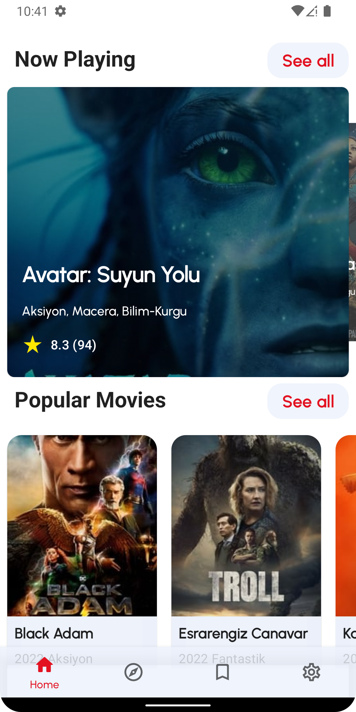
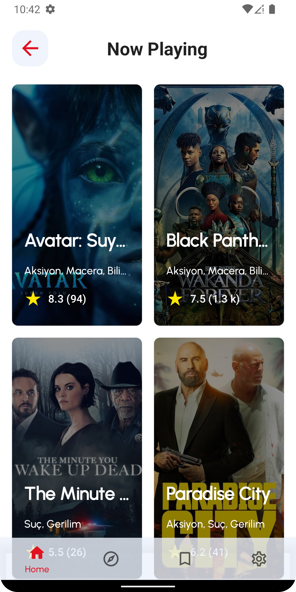
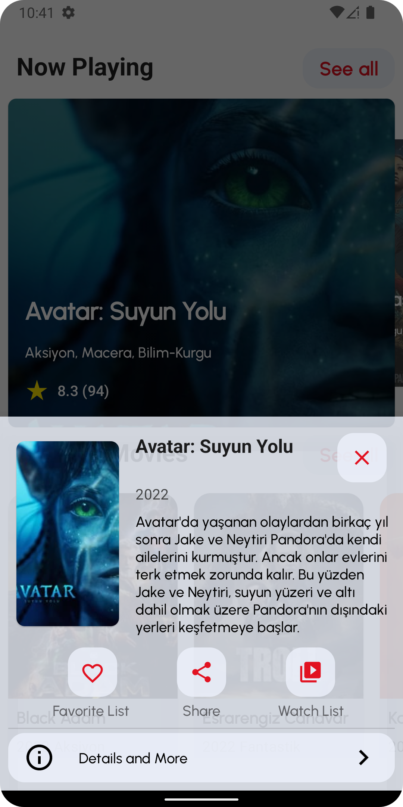
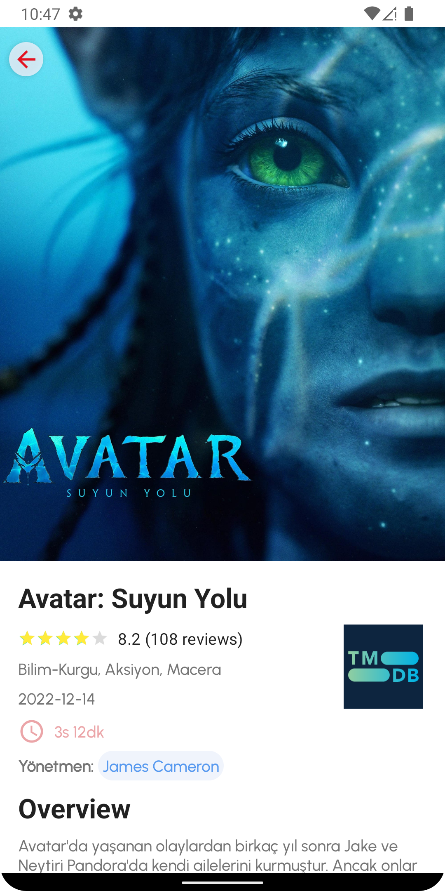
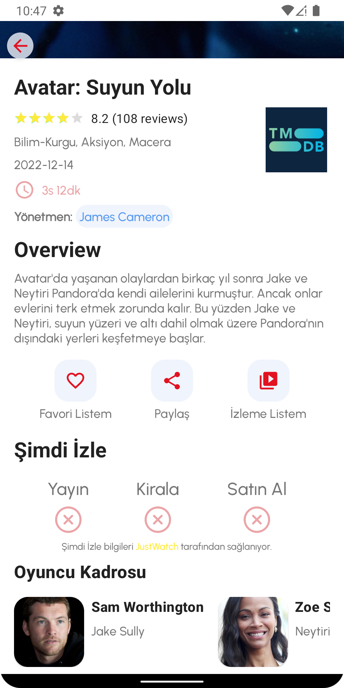

</div>
 
### Dark Version
***
<div>
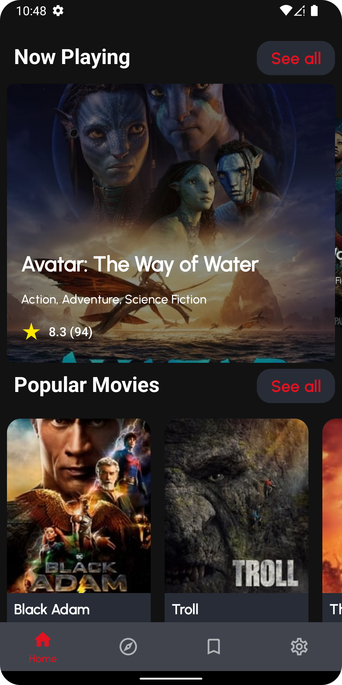
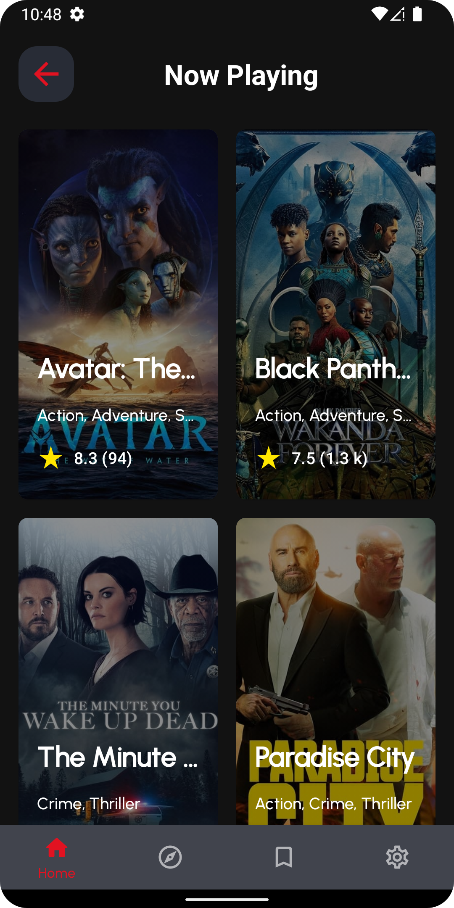
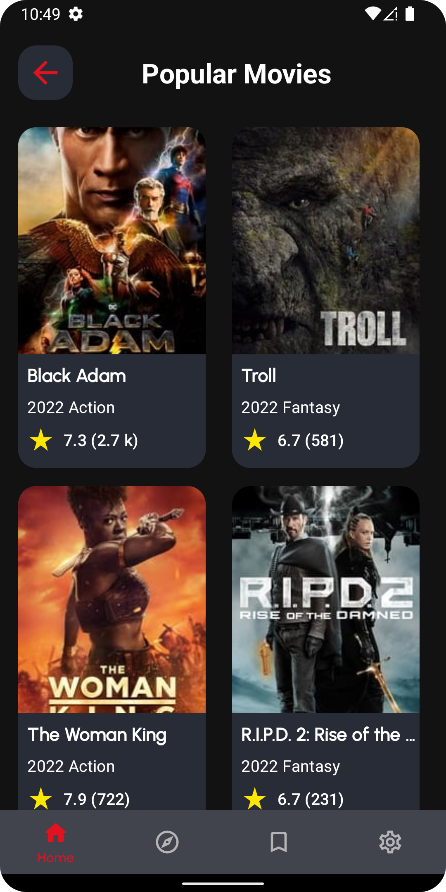
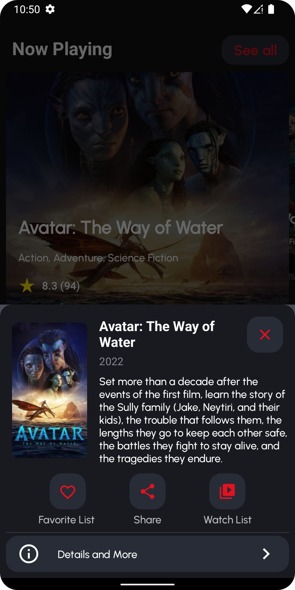
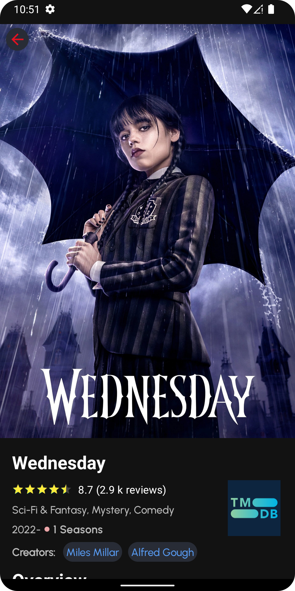
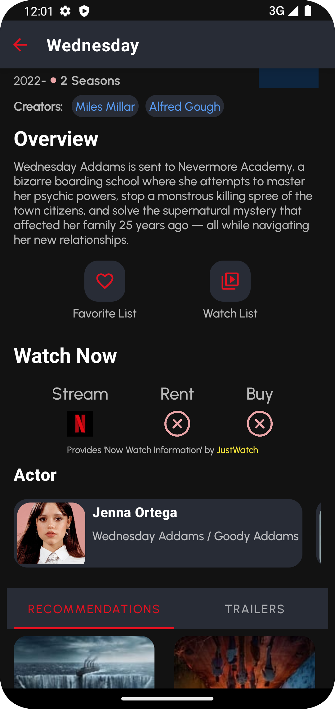
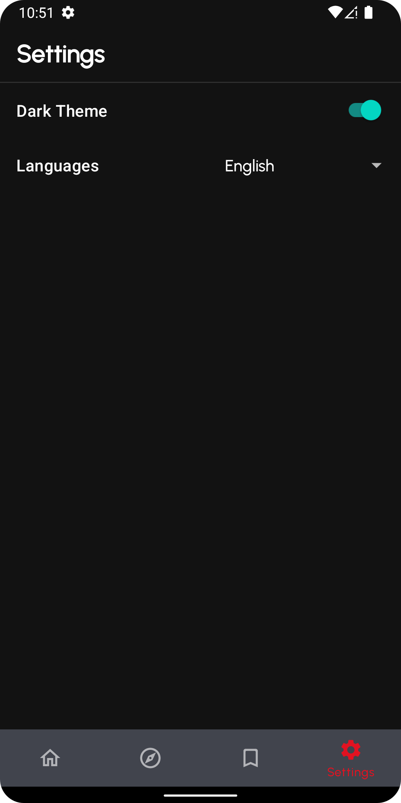
</div>


  
## Tech stack & Open-source libraries

- Minimum SDK level 24+
- 100% [Kotlin](https://kotlinlang.org/)
  based [Coroutines](https://github.com/Kotlin/kotlinx.coroutines) [Flow](https://developer.android.com/kotlin/flow) for asynchronous.

- [Android Architecture Components](https://developer.android.com/topic/architecture) - Collection
  of libraries that help you design robust, testable, and maintainable apps.
  - A single-activity architecture, using
    the [Navigation](https://developer.android.com/guide/navigation) to manage composable
    transactions.
  - [Lifecycle](https://developer.android.com/topic/libraries/architecture/lifecycle) - perform an
    action when lifecycle state change
  - [ViewModel](https://developer.android.com/topic/libraries/architecture/viewmodel) - Stores
    UI-related data that isn't destroyed on UI changes.
  - [UseCases](https://developer.android.com/topic/architecture/domain-layer) - Located domain layer
    that sits between the UI layer and the data layer.
  - [Repository](https://developer.android.com/topic/architecture/data-layer) - Located in data
    layer that contains application data and business logic

- [Hilt](https://developer.android.com/training/dependency-injection/hilt-android) -Dependency
  Injection Library
- [Paging](https://developer.android.com/topic/libraries/architecture/paging/v3-overview) - The
  Paging library makes it easier for you to load data incrementally and gracefully within your app's
  UI
- [Navigation](https://developer.android.com/guide/navigation) - Manage transaction among the
  fragments
- [Retrofit2 & OkHttp3](https://github.com/square/retrofit) - construct the REST APIs and paging
  network data.
- [Moshi](https://github.com/square/moshi) - A modern JSON library for Android, Java and Kotlin
- [Coil](https://github.com/coil-kt/coil) - An image loading library for Android backed by Kotlin
  Coroutines.
- Testing
  - [ Flow Turbine](https://github.com/cashapp/turbine) - Turbine is a small testing library for
    kotlinx.coroutines Flow.
  - [Truth](https://truth.dev/) - A library for performing assertions in tests
## Upcoming

- Modularization
- CI Support
- To able to add favorite list and watch list
- To able to watching trailer for movie and TvSeries
- UI and Unit Tests
## Find this repository useful? 
Don't forget give a star. ⭐
  
## Licence
```
    Designed and developed by 2022 tolgaprm (Tolga Pirim)

   Licensed under the Apache License, Version 2.0 (the "License");
   you may not use this file except in compliance with the License.
   You may obtain a copy of the License at

     http://www.apache.org/licenses/LICENSE-2.0

   Unless required by applicable law or agreed to in writing, software
   distributed under the License is distributed on an "AS IS" BASIS,
   WITHOUT WARRANTIES OR CONDITIONS OF ANY KIND, either express or implied.
   See the License for the specific language governing permissions and
   limitations under the License.
```
  
